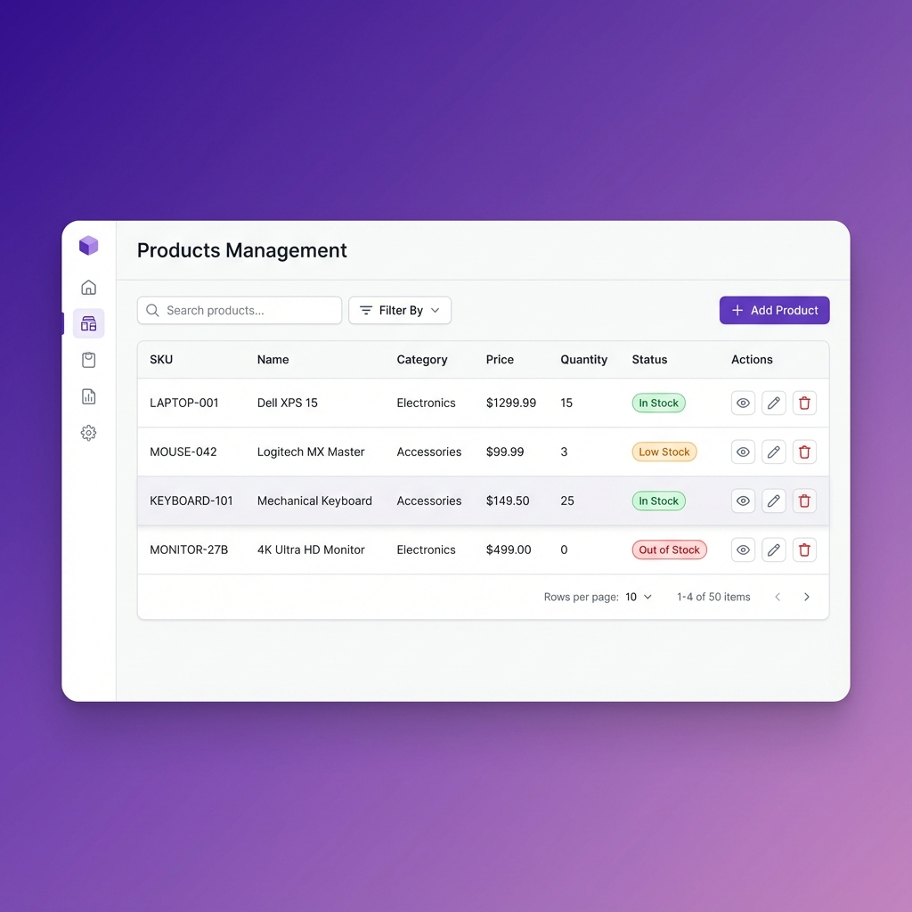
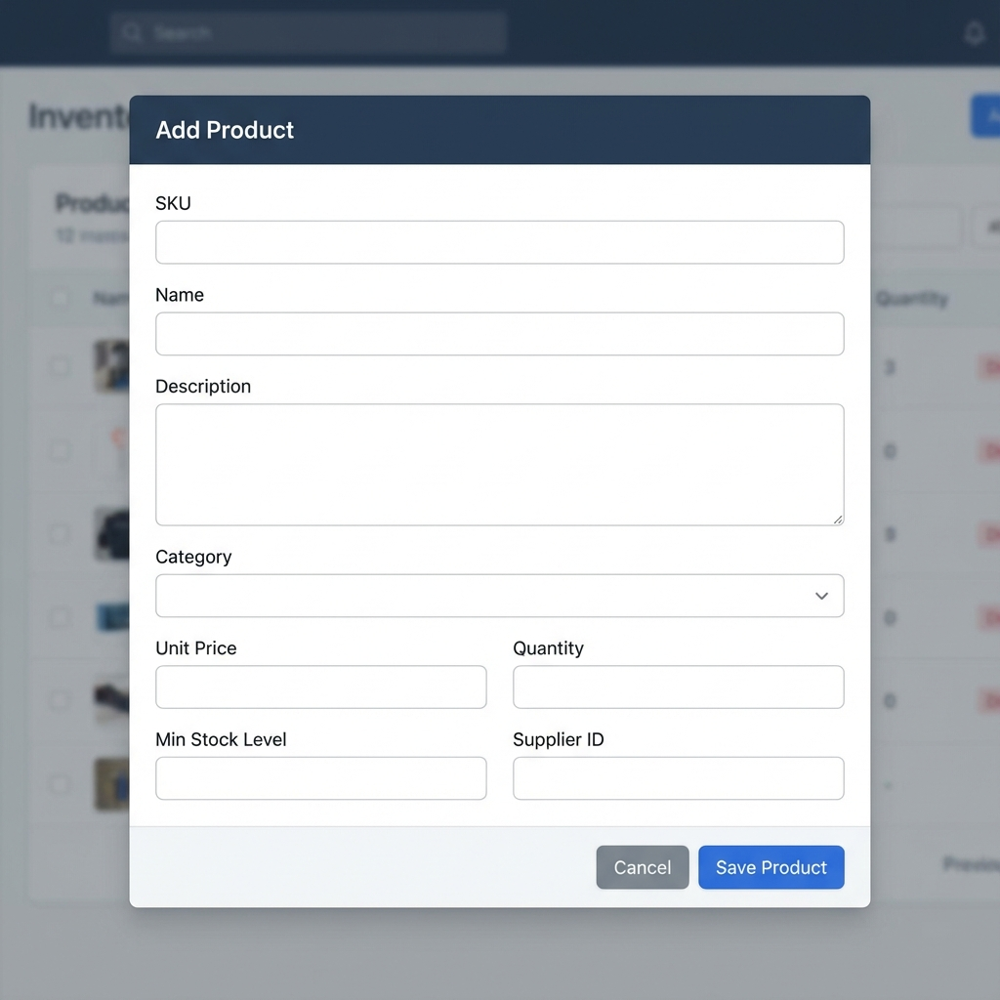
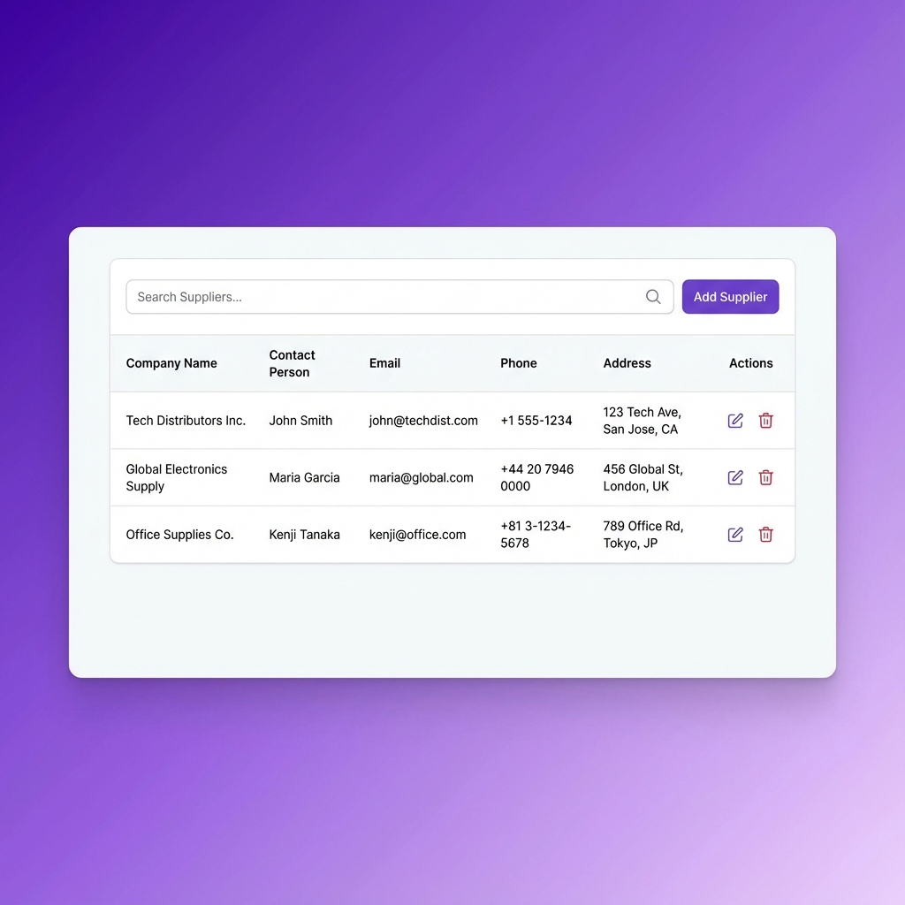
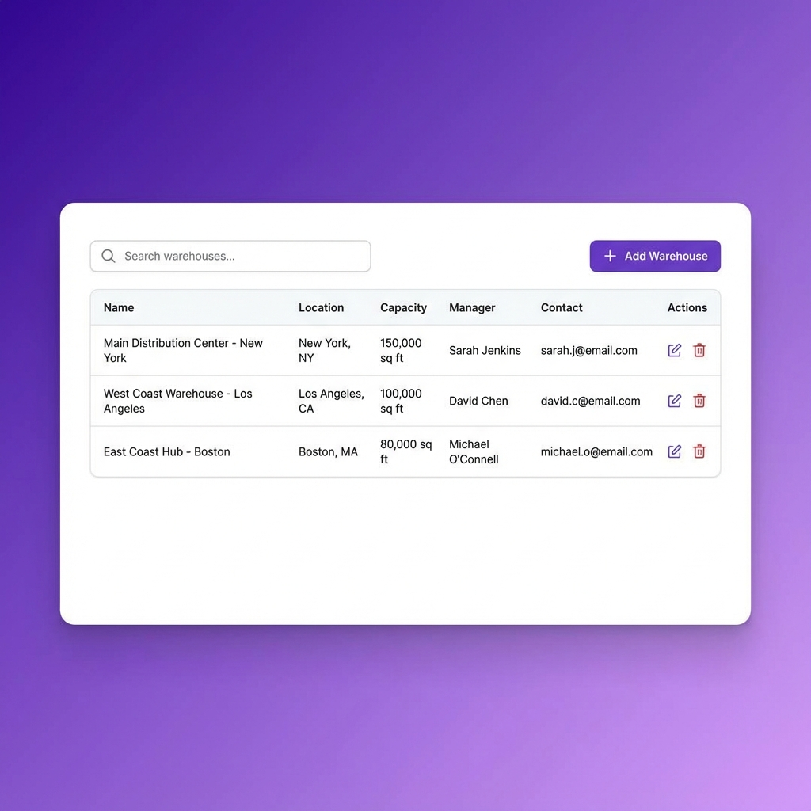

# Product Inventory Management System

A comprehensive web-based inventory management system built with Jakarta EE, featuring real-time tracking of products, suppliers, and warehouses.

## 📋 Table of Contents

- [Features](#features)
- [Screenshots](#screenshots)
- [Technology Stack](#technology-stack)
- [Quick Start](#quick-start)
- [Prerequisites](#prerequisites)
- [Installation & Setup](#installation--setup)
- [API Documentation](#api-documentation)
- [Project Structure](#project-structure)
- [Troubleshooting](#troubleshooting)

## ✨ Features

- **Product Management**: Create, read, update, and delete products with SKU tracking
- **Supplier Management**: Manage supplier information and relationships
- **Warehouse Management**: Track multiple warehouse locations and inventory
- **Real-time Statistics**: Dashboard with live inventory metrics
- **Low Stock Alerts**: Automatic tracking of products below minimum stock levels
- **RESTful API**: Full REST API for all operations
- **Responsive Design**: Modern, mobile-friendly interface
- **Search & Filter**: Advanced search and filtering capabilities

## 📸 Screenshots

### Dashboard


### Products Management


### Add/Edit Product Modal


### Suppliers Management


### Warehouses Management


## 🛠 Technology Stack

### Backend
- Jakarta EE 10 - Enterprise Java platform
- JAX-RS - RESTful web services
- JPA/Hibernate 6.4.5 - Object-relational mapping
- CDI - Contexts and Dependency Injection

### Frontend
- JSP - JavaServer Pages
- Bootstrap 5.3 - Responsive UI framework
- Font Awesome 6.4 - Icons
- Vanilla JavaScript - Client-side logic

### Database
- MySQL 8.0 - Relational database

### Build Tools
- Maven 3.x - Dependency management
- Java 23 - Programming language

## ⚡ Quick Start

### Prerequisites
- Java JDK 23
- Maven 3.6+
- MySQL 8.0+
- GlassFish 7.x (or compatible Jakarta EE server)

### Setup (5 Steps)

1. **Create Database**
```bash
mysql -u root -p
CREATE DATABASE inventory_db;
exit;
```

2. **Build Project**
```bash
mvn clean install
```

3. **Configure GlassFish JDBC**
```bash
cd <glassfish-home>/bin
./asadmin start-domain
./asadmin create-jdbc-connection-pool \
    --datasourceclassname com.mysql.cj.jdbc.MysqlDataSource \
    --restype javax.sql.DataSource \
    --property user=root:password=yourpassword:serverName=localhost:portNumber=3306:databaseName=inventory_db \
    InventoryPool
./asadmin create-jdbc-resource --connectionpoolid InventoryPool java:app/jdbc/InventoryDS
```

4. **Deploy Application**
```bash
./asadmin deploy <path-to-project>/target/IMS.war
```

5. **Access Application**
```
http://localhost:8080/IMS/
```

## 📦 Prerequisites

### Required Software

1. **Java Development Kit (JDK) 23**
   - Download from [Oracle](https://www.oracle.com/java/technologies/downloads/)
   - Verify: `java -version`

2. **Apache Maven 3.6+**
   - Download from [Maven](https://maven.apache.org/download.cgi)
   - Verify: `mvn -version`

3. **MySQL 8.0+**
   - Download from [MySQL](https://dev.mysql.com/downloads/mysql/)
   - Verify: `mysql --version`

4. **Jakarta EE Application Server**
   - GlassFish 7.x (Recommended) - [Download](https://glassfish.org/download)
   - WildFly 27+ - [Download](https://www.wildfly.org/downloads/)
   - Payara 6+ - [Download](https://www.payara.fish/downloads/)

## 🚀 Installation & Setup

### Step 1: Database Setup

```bash
# Start MySQL
mysql -u root -p

# Create database
CREATE DATABASE IF NOT EXISTS inventory_db;
USE inventory_db;
```

Or use the provided SQL file:
```bash
mysql -u root -p < create_db.sql
```

### Step 2: Configure Application Server

#### GlassFish Configuration

1. **Start GlassFish**
```bash
cd <glassfish-installation>/bin
./asadmin start-domain
```

2. **Create JDBC Connection Pool**
```bash
./asadmin create-jdbc-connection-pool \
    --datasourceclassname com.mysql.cj.jdbc.MysqlDataSource \
    --restype javax.sql.DataSource \
    --property user=root:password=yourpassword:serverName=localhost:portNumber=3306:databaseName=inventory_db \
    InventoryPool
```

3. **Create JDBC Resource**
```bash
./asadmin create-jdbc-resource \
    --connectionpoolid InventoryPool \
    java:app/jdbc/InventoryDS
```

4. **Deploy MySQL Connector**
   - Download MySQL Connector/J from [MySQL](https://dev.mysql.com/downloads/connector/j/)
   - Copy `mysql-connector-j-8.0.33.jar` to `<glassfish>/glassfish/domains/domain1/lib/`
   - Restart GlassFish

### Step 3: Build the Project

```bash
mvn clean install
```

### Step 4: Deploy the Application

**GlassFish:**
```bash
./asadmin deploy <path-to-project>/target/IMS.war
```

**WildFly:**
```bash
cp target/IMS.war <wildfly>/standalone/deployments/
```

### Step 5: Verify Installation

Access the application:
```
http://localhost:8080/IMS/
```

Test API endpoints:
```bash
curl http://localhost:8080/IMS/api/products
curl http://localhost:8080/IMS/api/stats/total-products
```

## 📚 API Documentation

### Base URL
```
http://localhost:8080/IMS/api
```

### Products API

| Method | Endpoint | Description |
|--------|----------|-------------|
| GET | `/products` | Get all products |
| GET | `/products/{id}` | Get product by ID |
| POST | `/products` | Create new product |
| PUT | `/products/{id}` | Update product |
| DELETE | `/products/{id}` | Delete product |
| GET | `/products/low-stock` | Get low stock products |
| GET | `/products/by-supplier/{supplierId}` | Get products by supplier |

### Suppliers API

| Method | Endpoint | Description |
|--------|----------|-------------|
| GET | `/suppliers` | Get all suppliers |
| GET | `/suppliers/{id}` | Get supplier by ID |
| POST | `/suppliers` | Create new supplier |
| PUT | `/suppliers/{id}` | Update supplier |
| DELETE | `/suppliers/{id}` | Delete supplier |

### Warehouses API

| Method | Endpoint | Description |
|--------|----------|-------------|
| GET | `/warehouses` | Get all warehouses |
| GET | `/warehouses/{id}` | Get warehouse by ID |
| POST | `/warehouses` | Create new warehouse |
| PUT | `/warehouses/{id}` | Update warehouse |
| DELETE | `/warehouses/{id}` | Delete warehouse |

### Statistics API

| Method | Endpoint | Description |
|--------|----------|-------------|
| GET | `/stats/total-products` | Get total products count |
| GET | `/stats/total-stock-value` | Get total inventory value |
| GET | `/stats/low-stock-count` | Get low stock items count |
| GET | `/stats/total-suppliers` | Get total suppliers count |
| GET | `/stats/total-warehouses` | Get total warehouses count |

### Example API Requests

**Create Product:**
```bash
curl -X POST http://localhost:8080/IMS/api/products \
  -H "Content-Type: application/json" \
  -d '{
    "sku": "LAPTOP-001",
    "name": "Dell XPS 15",
    "description": "High-performance laptop",
    "category": "Electronics",
    "unitPrice": 1299.99,
    "quantity": 15,
    "minStockLevel": 5,
    "supplierId": 1
  }'
```

**Get All Products:**
```bash
curl http://localhost:8080/IMS/api/products
```

**Update Product:**
```bash
curl -X PUT http://localhost:8080/IMS/api/products/1 \
  -H "Content-Type: application/json" \
  -d '{
    "sku": "LAPTOP-001",
    "name": "Dell XPS 15 Updated",
    "category": "Electronics",
    "unitPrice": 1399.99,
    "quantity": 20,
    "minStockLevel": 5,
    "supplierId": 1
  }'
```

**Delete Product:**
```bash
curl -X DELETE http://localhost:8080/IMS/api/products/1
```

## 📁 Project Structure

```
Product-Inventory-Management-System/
├── src/
│   ├── main/
│   │   ├── java/com/horizon/ims/
│   │   │   ├── api/                    # REST API Resources
│   │   │   │   ├── ApplicationConfig.java
│   │   │   │   ├── ProductResource.java
│   │   │   │   ├── SupplierResource.java
│   │   │   │   ├── WarehouseResource.java
│   │   │   │   └── StatisticsResource.java
│   │   │   ├── entity/                 # JPA Entities
│   │   │   │   ├── Product.java
│   │   │   │   ├── Supplier.java
│   │   │   │   ├── Warehouse.java
│   │   │   │   └── StockLevel.java
│   │   │   ├── repository/             # Data Access Layer
│   │   │   │   ├── ProductRepository.java
│   │   │   │   ├── SupplierRepository.java
│   │   │   │   ├── WarehouseRepository.java
│   │   │   │   └── StockLevelRepository.java
│   │   │   └── service/                # Business Logic Layer
│   │   │       ├── ProductService.java
│   │   │       ├── SupplierService.java
│   │   │       └── WarehouseService.java
│   │   ├── resources/META-INF/
│   │   │   └── persistence.xml         # JPA Configuration
│   │   └── webapp/
│   │       ├── WEB-INF/
│   │       │   ├── beans.xml           # CDI Configuration
│   │       │   └── web.xml             # Web Application Config
│   │       ├── index.jsp               # Dashboard Page
│   │       ├── products.jsp            # Products Management
│   │       ├── suppliers.jsp           # Suppliers Management
│   │       └── warehouses.jsp          # Warehouses Management
│   └── test/java/                      # Unit Tests
├── pom.xml                             # Maven Configuration
└── create_db.sql                       # Database Setup Script
```

## 🔧 Troubleshooting

### Database Connection Error

**Problem:** Application can't connect to MySQL

**Solution:**
- Verify MySQL is running: `systemctl status mysql` (Linux) or check Services (Windows)
- Check database credentials in persistence.xml
- Ensure JDBC datasource is properly configured
- Verify MySQL Connector JAR is in server's lib directory

### 404 Error on API Endpoints

**Problem:** REST API returns 404 Not Found

**Solution:**
- Check application context path (should be `/IMS`)
- Verify JAX-RS configuration in `ApplicationConfig.java`
- Ensure application is properly deployed
- Check server logs for deployment errors

### Build Failures

**Problem:** Maven build fails

**Solution:**
```bash
# Clean and rebuild
mvn clean install -U

# Skip tests if needed
mvn clean install -DskipTests
```

### Port Already in Use

**Problem:** Application server won't start

**Solution:**
```bash
# Windows
netstat -ano | findstr :8080
taskkill /PID <process-id> /F

# Linux/Mac
lsof -i :8080
kill -9 <process-id>
```

### Viewing Logs

**GlassFish:**
```
<glassfish>/glassfish/domains/domain1/logs/server.log
```

**WildFly:**
```
<wildfly>/standalone/log/server.log
```

## 🤝 Contributing

1. Fork the repository
2. Create a feature branch (`git checkout -b feature/AmazingFeature`)
3. Commit your changes (`git commit -m 'Add some AmazingFeature'`)
4. Push to the branch (`git push origin feature/AmazingFeature`)
5. Open a Pull Request

## 📄 License

This project is licensed under the MIT License.

---

**Version:** 1.0.0  
**Last Updated:** December 2025  
**Status:** Production Ready
